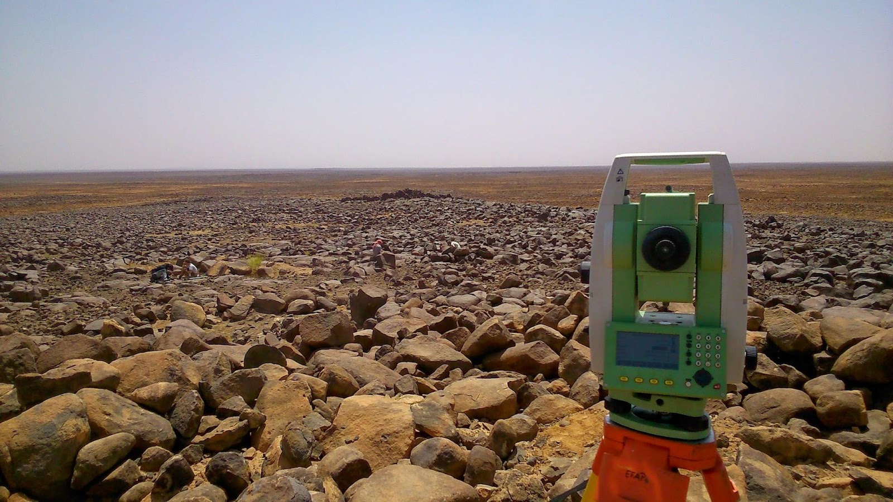
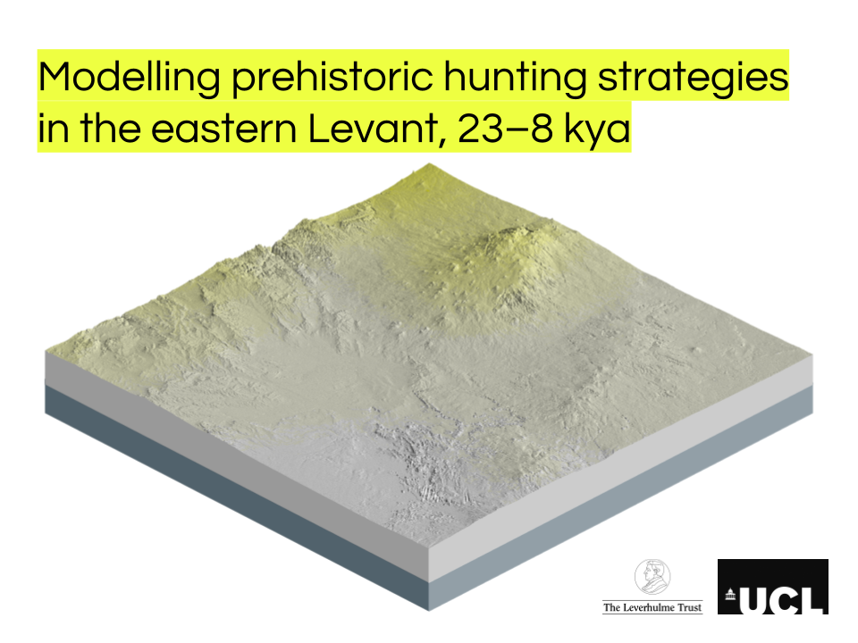
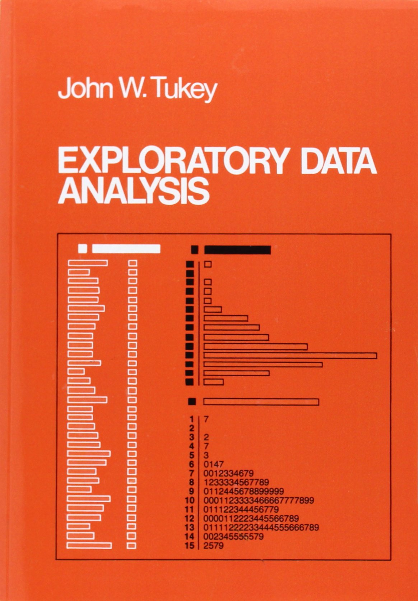
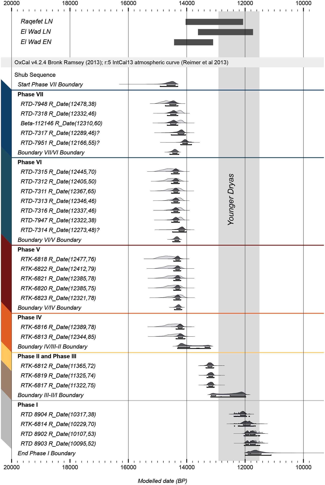
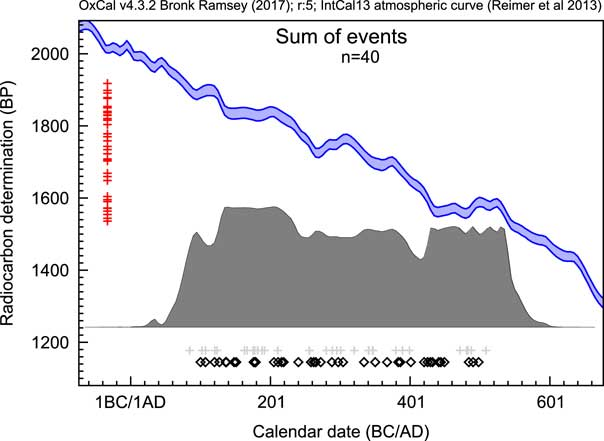
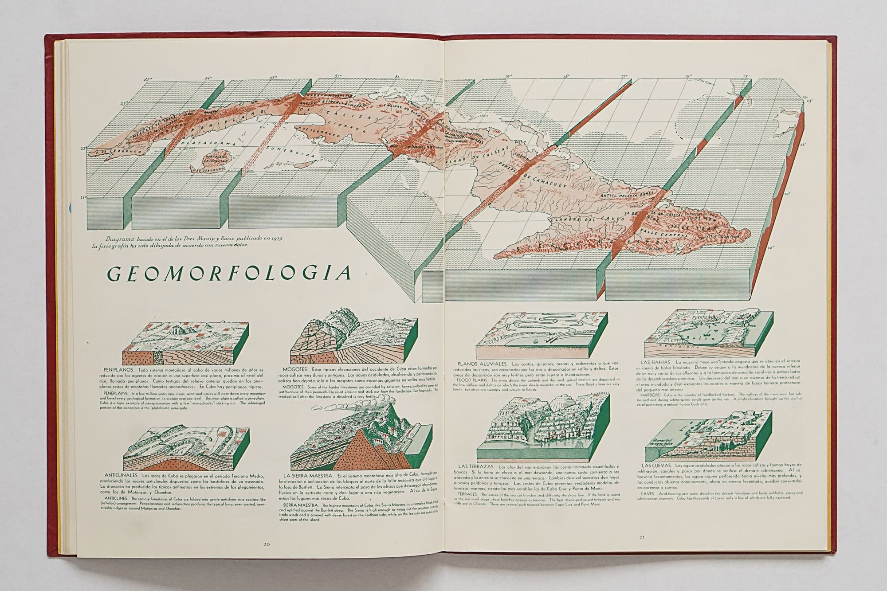
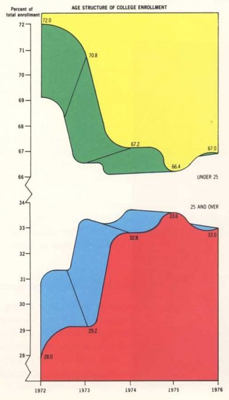

class: middle

```{r setup, include=FALSE}
options(htmltools.dir.version = FALSE)
knitr::opts_chunk$set(out.width = '100%', fig.asp = 0.618, fig.retina = 5)

library("tidyverse")
library("gt")
library("scales")
library("rcarbon")
library("sf")
library("rnaturalearth")
library("tidygraph")
library("ggraph")
library("stratigraphr")
source("R/tidy_rcarbon.R")
```
```{r xaringan-themer, include = FALSE}
library("xaringanthemer")
mono_accent(
  base_color = "#d79921",
  white_color = "#ffffff",
  black_color = "#3c3836",
  text_bold_color = "#3c3836",
  code_inline_color = "#3c3836",
  text_font_google   = google_font("Source Sans Pro", "400", "400i"),
  header_font_google = google_font("Source Sans Pro", "600", "600i"), 
  header_font_weight = "600",
  code_font_google   = google_font("Source Code Pro"),
  text_font_size = "18pt",
  header_h1_font_size = "36pt",
  header_h2_font_size = "30pt",
  header_h3_font_size = "24pt",
  code_font_size = "11pt",
  code_inline_font_size = "90%"
)
```

.pull-left[


]

.pull-right[
**Joe Roe**  
Research assistant  
University of Copenhagen  

https://joeroe.io  
https://github.com/joeroe  
https://twitter.com/joeroe90 
]

---
class: center, middle

```{r programme-table, echo=FALSE}
tibble(Day = c("Wednesday", "", "Thursday", ""),
       Time = c("10–13", "14–17", "10–13", "14–17"),
       Topics = c(
"**Introduction to visualisation with R**
* Visualisation in data science
* Overview of R graphics packages
* Plotting with `base`",
"**Tidy visualisation with `ggplot2`**
* The 'grammar of graphics'
* Visualisation and tidy data
* Plotting with `ggplot2`",
"**Advanced visualisations for archaeologists**
* Radiocarbon chronologies with 'ridgeplots'
* Cartography in R: `sf` and `ggplot2`
* 3D topography with `rayshader`",
"**Publication-ready visualisations**
* What makes an effective graphic?
* Advanced `ggplot2`: aesthetics and themes
* Publishing with `RMarkdown`"),
       Exercises = c("*Quantitative Archaeology*, ch. 5", 
                     "*R for Data Science*, ch. 3 & 7",
                     "To be provided",
                     "*R for Data Science*, ch. 27–28")) %>% 
  gt() %>% 
  fmt_markdown(everything()) %>% 
  tab_style(cell_text(size = "small", align = "left", v_align = "top"), cells_body()) %>% 
  tab_style(cell_text(weight = "bold"), cells_column_labels(TRUE)) %>% 
  tab_style(cell_text(weight = "bold"), cells_body(columns = c("Day", "Time")))
```

---
class: inverse, center, middle

# Visualisation with R
## Introduction

---
class: center, middle


.center[<small>Data science workflow. After Wickham & Grolemund, *R for Data Science*</small>]

???

* We use visualisations (graphs, plots, etc.) to communicate things about data
* But visualisations are also extremely important for you the analyst to *understand* the data
* Hadley's "understand" cycle here encapsulates *exploratory data analysis*

---

# Exploratory Data Analysis (EDA)

.pull-left[
<small>
> Exploratory data analysis (EDA) is an essential step in any research analysis. The primary aim with exploratory analysis is to examine the data for distribution, outliers and anomalies to direct specific testing of your hypothesis. It also provides tools for hypothesis generation by visualizing and understanding the data usually through graphical representation. EDA aims to assist the natural patterns recognition of the analyst. 
>
> *Komorowski et al. 2016*
</small>
]

.pull-right[

]

???

* John Tukey's *exploratory data analysis* (EDA) was an alternative (complementary) approach to hypothesis-testing statistics emphasising iterative exploration of data, especially using visual methods 
* Tukey's approach was influential in the development of *S*, and by extension *R* – R is very much designed to do EDA
* The modern "data science" approach was born with EDA and visualisation at its core

---

# Graphics packages in R

```{r plot-demo-data}
library("archdata")
data("BACups")
```

.pull-left[
```{r plot-demo-base, echo=FALSE}
plot(BACups$H, BACups$RD)
```
```{r plot-demo-base, eval=FALSE}
```
]

.pull-right[
```{r plot-demo-ggplot, echo=FALSE}
ggplot(BACups, aes(x = H, y = RD)) +
  geom_point()
```
```{r plot-demo-ggplot, eval=FALSE}
```
]

???

* base, ggplot2, and lattice (now rarely used)
* Major differences in syntax, and by extension flexibility and capabilities

---

.pull-left[
```{r plot-demo-base-ext, echo=FALSE}
par(mfrow = c(1,2))
plot(BACups[BACups$Phase=="Protoapennine",]$H,
     BACups[BACups$Phase=="Protoapennine",]$RD,
     cex = BACups[BACups$Phase=="Protoapennine",]$ND / 10,
     main = "Bronze Age cups",
     sub = "Protoapennine",
     xlab = "Height",
     ylab = "Rim Diameter")
plot(BACups[BACups$Phase=="Subapennine",]$H,
     BACups[BACups$Phase=="Subapennine",]$RD,
     cex = BACups[BACups$Phase=="Subapennine",]$ND / 10,
     main = "(Data from Lukesh and Howe 1978)",
     sub = "Subapennine",
     xlab = "Height",
     ylab = "Rim Diameter")
legend("bottomright", 
       title = "Neck Diameter", 
       pch = 1,
       legend = c(10, 15, 20, 25), 
       pt.cex = c(1, 1.5, 2, 2.5))
```
```{r plot-demo-base-ext, eval=FALSE}
```
]

.pull-right[
```{r plot-demo-ggplot-ext, echo=FALSE}
ggplot(BACups, aes(x = H, y = RD, size = ND)) +
  geom_point(shape = 1) +
  facet_wrap(vars(Phase)) +
  labs(x = "Height", 
       y = "Rim Diameter", 
       size = "Neck Diameter",
       title = "Bronze Age cups", 
       subtitle = "Data from Lukesh and Howe (1978)")
```
```{r plot-demo-ggplot-ext, eval=FALSE}
```
]

???

* The syntax differences are highlighted when you try to do more complex plots
* Some debate over the pros and cons of each – I see ggplot2 as a straightforward upgrade at this point
* But it's important to know base as the 'default' in a lot of cases, e.g. used by many packages to plot complex data structures

---

# Plotting with `base`: exercises

**Carlson 2017, *Quantitative Methods in Archaeology Using R***

**Chapter 5 – Looking at Data: Graphs** (skip the first section)

* Create a new script in RStudio
* Replicate all Carlson's code
* Think about Carlson's code – how could you adapt it to do something different?
* Answer questions as comments (`# Here is my answer...`)
* Shout at me if you get stuck!

---

# Plotting with `base`: extension exercises

1. Using the `MaskSite` data, make a) a pie chart and b) a bar plot of the frequency of artefacts by category. Which do you think is more effective?

---
class: inverse, center, middle

# Tidy Visualisation
## The `ggplot2` package

---
class: middle

# The Grammar of Graphics


???

* `ggplot2` is based on the "grammar of graphics"
* This is a structured way of *describing* the relationship between data and graphical elements – as opposed to `base` graphics, which is you *telling* R what to plot
* Specifically, `ggplot` introduces a *layered* grammer of graphics, allowing you to combine multiple mappings into a single plot
* This makes it much more flexible than base and allows us to maintain readable code for even very complicated plots
* Further reading: 
  * Wickham 2010, *A Layered Grammar of Graphics*
  * Wilkinson, Anand & Grossman 2005, *The Grammar of Graphics*

---

# ggplot2 and tidy data

.pull-left[
```{r tidy-rcarbon, eval=FALSE}
data("emedyd") # From rcarbon
emedyd %>% 
  filter(SiteName == "Nevali Cori") %>% 
  arrange(CRA) %>% 
  mutate(LabID = as_factor(LabID)) %>% 
  mutate(CalDate = cal(CRA, Error, verbose = FALSE)) %>% 
  unnest_legacy() %>% 
  ggplot(aes(calBP, PrDens)) +
  facet_wrap(~LabID, ncol = 1, 
             scales = "free_y", 
             strip.position = "left") +
  geom_area() + 
  scale_x_reverse() +
  labs(title = "Nevali Cori",
      subtitle = "Radiocarbon chronology") +
  theme(axis.title.y = element_blank(),
        axis.text.y = element_blank(),
        axis.ticks.y = element_blank(),
        panel.grid.minor.y = element_blank(),
        panel.grid.major.y = element_blank())
```
]

.pull-right[
```{r tidy-rcarbon, echo=FALSE, fig.asp=1.3}
```
]

???

* `ggplot2` is super-charged when used as part of a "tidy data analysis" workflow
* For example, *pipes* allow us to elegently and concisely load data, clean and filter, and plot in a single code block
* Caveat: data does have to be in a roughly tabular (if not fully "tidy") structure to work well with ggplot. Complex objects from other packages can be a challenge to work with.

---

# Plotting with `ggplot2`: exercises

**Wickham & Grolemund, *R for data science***

https://r4ds.had.co.nz/

Chapter 2: *Data visualisation*

Chapter 7: *Exploratory Data Analysis* (if you have time)

* Install the `tidyverse` metapackage
* Run Hadley's code examples
* Answer questions as comments (`# Here is my answer...`)
* Do the 'exercises' sections – they're very informative!

---

# Plotting with `ggplot2`: applications?

.pull-left[
```{r ggplot-scatter, echo=FALSE}
ggplot(data = ggplot2::mpg) + 
  geom_point(mapping = aes(x = displ, y = hwy))
```
```{r ggplot-smooth, echo=FALSE}
ggplot(data = ggplot2::mpg) + 
  geom_point(mapping = aes(x = displ, y = hwy)) +
  geom_smooth(mapping = aes(x = displ, y = hwy),
              method = "loess", formula = y ~ x)
```
]

.pull-right[
```{r ggplot-bar, echo=FALSE}
ggplot(data = ggplot2::diamonds) + 
  geom_bar(mapping = aes(x = cut, fill = clarity))
```
```{r ggplot-boxplot, echo=FALSE}
ggplot(data = ggplot2::mpg, mapping = aes(x = class, y = hwy)) + 
  geom_boxplot() +
  coord_flip()
```
]

???

We've seen how to do a few fundamental plots with ``ggplot2` today, but using "dummy" datasets like cars and diamonds. What are some archaeological applications of these plots?

---
class: inverse, center, middle

# Advanced visualisations
## Plotting archaeological data

---

# Cartography: R as a GIS

.pull-left[
* Spatial data
  * `rgdal`, `rgeos`
  * `sp`, `sf`
  * `raster`, `stars`
* Geostatistics
  * `gstat`, `spdep`, `nlme`
  * `landsat`, `dismo`
  * Many, many more...
]
.pull-right[
* Base maps + open data
  * `maps`, `maptools`, `rnaturalearth`
  * `ggmap`, `leaflet`, `mapview`
  * `rOpenSci`
* Cartography
  * `ggplot2`
  * `rasterVis`
]

---

```{r eg-tavo, echo=FALSE, results='hide', message=FALSE, warning=FALSE}
tavo <- read_tsv("data/tavo-a27.tsv", col_types = cols())

# Reshape data into a table of occurrences
tavo %>% 
  gather("taxon", "occurrence", 9:79) %>% 
  filter(occurrence == 1) ->
  tavo

# Recode and filter to selected taxa of interest
tavo %>% 
  mutate(taxon = case_when(
    grepl("Gazella*", taxon) ~ "Gazella",
    grepl("Equus*", taxon) ~ "Equus",
    grepl("Dama*", taxon) ~ "Dama",
    grepl("Ovis*", taxon) ~ "Ovicaprid",
    grepl("Capra*", taxon) ~ "Ovicaprid",
    grepl("Bos*", taxon) ~ "Bos",
    grepl("Sus*", taxon) ~ "Sus",
  )) %>% 
  filter(taxon %in% c("Gazella", "Equus", "Dama", "Ovicaprid", "Bos", "Sus")) ->
  tavo

# Convert to simple features spatial object
tavo %>% 
  drop_na(latitude, longitude) %>% 
  st_as_sf(crs = 4326, coords = c("longitude", "latitude"), remove = FALSE,
           agr = "constant") %>% 
  st_transform(crs = 22770) -> # EPSG:22770 / Syria Lambert
  tavo

# Plot
box <- st_bbox(tavo)
land <- ne_download(110, "land", "physical", returnclass = "sf") %>% 
  st_crop(xmin = 0, xmax = 90, ymin = 0, ymax = 60) %>% 
  st_transform(crs = 22770)

ggplot(tavo) +
  facet_wrap(vars(taxon)) +
  geom_sf(data = land, fill = "white") +
  geom_sf() +
  coord_sf(xlim = c(box$xmin, box$xmax), ylim = c(box$ymin, box$ymax),
           label_axes = "----")
```

---

# Radiocarbon

.pull-left[

.center[<small>Richter et al. 2017</small>]
]

.pull-right[

.center[<small>Bronk Ramsey 2017</small>]
]

---

# Radiocarbon packages in R

* Databases
  * `c14bazAAR`
* Calibration
  * `oxcAAR` (interface for OxCal)
  * `rcarbon` (including summed distributions)
  * `stratigraphr` (WIP!)

---

```{r tidy-rcarbon, echo=FALSE, fig.asp=1.3}
```

---

# Stratigraphy (`tidygraph` & `ggraph`)

```{r eg-stratigraphy, echo=FALSE}
data("harris12")
stratigraph(harris12, "context", "above") %>% 
  ggraph(layout = "sugiyama") +
  geom_edge_elbow() +
  geom_node_label(aes(label = context), label.r = unit(0, "mm")) +
  theme_graph()
```

---
class: center, middle

# 3D (`rayshader` & `rayrender`)


???

* Note of caution
  * Bad 3D (purely decorative)
  * Dodgy 3D (functional, but usually better options)
  * Good 3D! (things that are 3D, e.g. objects, topography)
  
---
class: center, middle



.center[<small>Gerardo Canet & Erwin Raisz, *Atlas de Cuba* (1949)</small>]

---
class: center, middle


---

.pull-left[
```{r eg-tavo, results='hide', message=FALSE, warning=FALSE, echo=FALSE}
```
```{r tidy-rcarbon, echo=FALSE, fig.asp=1.3}
```
]

.pull-right[
```{r eg-stratigraphy, echo=FALSE}
```

]

???

Form groups and try to recreate one of these visualisations.

---
class: inverse, center, middle

# Publication-ready visualisations
## `ggplot2` and `RMarkdown`

---

# Publishing with RMarkdown

* Notebooks
* Papers & theses (`rrtools`)
* Books (`bookdown`, e.g. *R for Data Science*)
* Slides (`xaringan`, e.g. these!)
* Interactive interfaces (`shiny`, e.g. https://joeroe.shinyapps.io/LAC2018_fieldwalkr/)

???

* RMarkdown is a modern take on 'literate programming' (cf. Knuth) in R
* It can now export to almost any format

---

# RMarkdown for science: research compendia

.pull-left[
A **research compendium** packages together all the **data**, **code**, **figures**, and **text** that comprise a scientific analysis in a single place (e.g. an R package).

The idea is to make the analysis fully **reproducible** from start to finish.

The R package `rrtools` assists with creating these in R.
]

.pull-right[

]

---
class: center, middle

# Effective visualisations: Tufte's principles

1. Above all else show data.
2. Maximize the data-ink ratio.
3. Erase non-data-ink.
4. Erase redundant data-ink.
5. Revise and edit.

---
class: center, middle


> The worst graphic ever to find its way into print
> – Tufte 

---

```{r tufte-data, include=FALSE}
tufte_data <- tibble(year = rep(1972:1976, 2),
                     age_group = c(rep("<25", 5), rep(">=25", 5)),
                     enrollment = c(0.72, 0.708, 0.672, 0.664, 0.67,
                                    0.28, 0.292, 0.328, 0.336, 0.33))
```

```{r tufte-graphic-improved}
tufte_data %>% 
  filter(age_group == "<25") %>% 
  ggplot(aes(x = year, y = enrollment)) +
  geom_line() +
  scale_y_continuous(limits = c(0, 1), labels = percent) +
  labs(title = "Enrollment under 25") +
  theme_minimal()
```

???

R nudges you into making good graphics (as opposed to Excel!)

---

# `ggplot2` and `RMarkdown`: exercises

**Wickham & Grolemund, *R for data science***

https://r4ds.had.co.nz/

Chapter 27: *R Markdown*

Chapter 28: *Graphics for communication*

* Run Hadley's code examples
* Answer questions as comments (`# Here is my answer...`)
* Do the 'exercises' sections – they're very informative!

---

# Further reading

* Wickham & Grolemund, *R for Data Science*, https://r4ds.had.co.nz/
  * Hadley also recommends lots of good books!
* Wickham 2009, *ggplot2: Elegant Graphics for Data Analysis*
* Xie 2015, *Dynamic Documents with R and knitr*
* Marwick et al. 2017, *Packaging Data Analytical Work Reproducibly Using R (and Friends)*, https://doi.org/10.1080/00031305.2017.1375986
* Wickham 2020, *Mastering `Shiny`*, https://mastering-shiny.org/
* RStudio cheatsheets, https://rstudio.com/resources/cheatsheets/