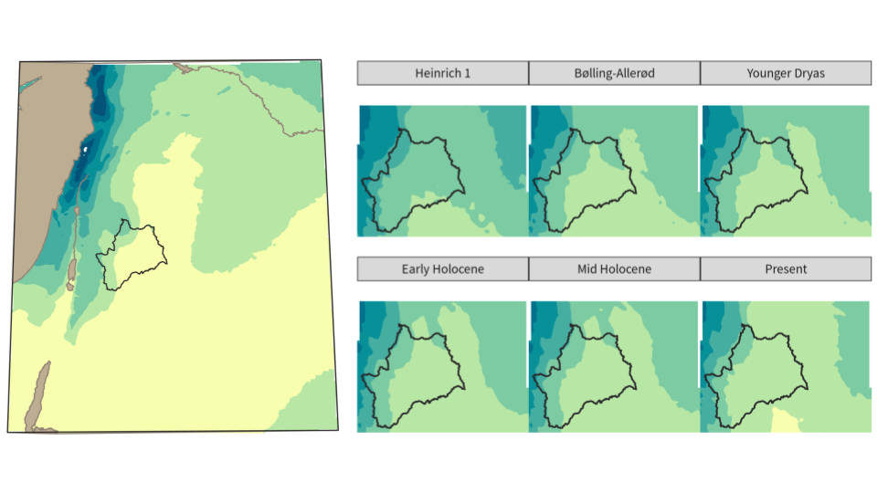
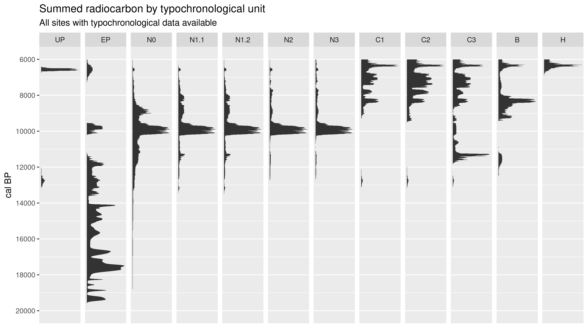
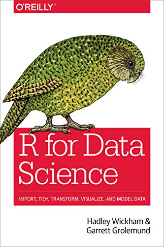

class: middle
background-image: url("figures/jr-survey.png")
background-size: 67%

```{r setup, include=FALSE}
options(htmltools.dir.version = FALSE)
knitr::opts_chunk$set(out.width = '100%', fig.asp = 0.618, fig.retina = 5)

library("tidyverse")
library("gt")
library("scales")
library("rcarbon")
library("sf")
library("raster")
library("ggspatial")
library("ggraph")
library("stratigraphr")
library("fontawesome")
source("R/tidy_rcarbon.R")
```
```{r xaringan-themer, include = FALSE}
library("xaringanthemer")
style_mono_accent(
  base_color = "#d79921",
  white_color = "#ffffff",
  black_color = "#3c3836",
  text_bold_color = "#3c3836",
  code_inline_color = "#3c3836",
  text_font_google   = google_font("Source Sans Pro", "400", "400i"),
  header_font_google = google_font("Source Sans Pro", "600", "600i"), 
  header_font_weight = "600",
  code_font_google   = google_font("Source Code Pro"),
  text_font_size = "16pt",
  header_h1_font_size = "30pt",
  header_h2_font_size = "24pt",
  header_h3_font_size = "18pt",
  code_font_size = "9pt",
  code_inline_font_size = "90%"
)
```

.pull-left[


**Joe Roe**  
University of Bern  

* `r fa("link")` [joeroe.io](https://joeroe.io)
* `r fa("github")` [joeroe](https://github.com/joeroe)
* `r fa("twitter")` [@joeroe](https://twitter.com/joeroe90)
]

.pull-right[


]

???

* Introducing myself

---
class: center, middle

```{r programme-table, echo=FALSE}
tibble(Day = c("Monday", "", "Tuesday", "", "Wednesday"),
       Time = c("10–13", "14–17", "10–13", "14–17", "10–13"),
       Topics = c(
"**Introduction to visualisation in R**
* Visualisation in data science
* Overview of R graphics packages
* ggplot2: The 'grammar of graphics'",
"**Visualisation for Exploratory Data Analysis**
* Applications in archaeology
* Visualising 'tidy data'
* `ggplot2` for EDA",
"**CartogRaphy**
* R as a GIS /  R isn't a GIS
* Mapping with `ggplot2`
* Extensions: `tmap`, `ggspatial`, `gganimate`",
"**Advanced visualisation exercises**
* Tables: `gt`
* Radiocarbon: `ggridges`
* Multivariate analysis: `dimensio`
* 3D: `rayshader`",
"**Publication-ready visualisation**
* What makes an effective graphic?
* Advanced `ggplot2`: aesthetics and themes
* Tips for the real world"),
       Exercises = c("*R for Data Science*, ch. 3", 
                     "*R for Data Science*, ch. 7 & 11",
                     "*ggplot2*, ch. 6",
                     "*Groupwork*",
                     "*R for Data Science*, ch. 28")) %>% 
  gt() %>% 
  fmt_markdown(everything()) %>% 
  tab_style(cell_text(size = "small", align = "left", v_align = "top"), 
            cells_body()) %>% 
  tab_style(cell_text(weight = "bold"), cells_column_labels(everything())) %>% 
  tab_style(cell_text(weight = "bold"), cells_body(columns = c("Day", "Time")))
```

???

* The "Visualisation" module follows on from the introduction to R you've had so far
* We'll start by outlining the through the two major graphics packages in R: "base" and `ggplot2`
* 
* Then tomorrow, we'll look at some specific "advanced" visualisation techniques relevant to archaeology:
  * First spatial visualisations and mapping, following on from last week's module on spatial analysis
  * Then a selection of other specific applications – subject to change!
* And finally, on Wednesday, we'll discuss preparing plots ready for final publication
* I would like this to be as hands-on as possible, so the format for this module is you doing exercises at your own pace, with me dropping in to explain things as needed

---
class: center, middle

View these slides online:  
<https://joeroe.io/r4r_visualisation/r4r_visualisation_slides.html>

Source code:  
<https://github.com/joeroe/r4r_visualisation>

<small>They're written in RMarkdown!</small>

---
class: inverse, center, middle

# Visualisation with R
## Introduction

???

* Why use R for visualisations? Or: why did we devote a quarter of this course to visualisation?
* Most of you are probably here because, in some way or other, you want to use R to "do statistics"
* As you go up the admittedly steeper learning curve of visualisations in R, you might ask: why not just export the result to a more intuitive programme like Excel, and make the plots there?
* For that I have three answers:
  * (or four: the zeroth being because Excel is bad software, don't use it)

---
class: center, middle


.center[<small>Data science workflow. After Wickham & Grolemund, *R for Data Science*</small>]

???

* First—and this is why we are we looking at visualisations now, rather than at the end—is that visualisation is not just the end product of a statistical analysis, something you use to **communicate**, but right at its centre, as something that helps us **understand**.
* In the exploratory data analysis (EDA) or modern "data science" workflow (illustrated very nicely here in a figure from Hadley Wickham's *R for Data Science*), visualisation is one of the pillars of data analysis
* You should use graphics often, to help you understand data as you go through the iterative cycle of interrogating and modelling it

---
class: center, middle

.pull-left[

]

.pull-right[

]

???

* This is an old idea: starting with 'exploratory data analysis', and continued in modern 'data science'
* Computers obviously make it a lot easier to generate plots quickly;
* And R was in fact originally designed to facilitate EDA, so it's very well suited for it: once you've mastered the basic graphics functions, you can generate plots easily and often

---
class: middle

# R: a statistical *programming language*

1. Iterate
2. Scale
3. Reproduce

???

* Second, R is a statisical *programming language*. This has powerful advantages compared to traditional workflows for producing plots:
  * Iteration: generate your final plot and realise you need to change something in the source data? No problem!
  * Scalability: write code to visualise X about Y; then run it on 1000 (or 10000, or 100000) values of Y
  * Reproducibility: everybody can see exactly the steps you took to produce a plot

---
class: center, middle

## `bbplot` <<https://github.com/bbc/bbplot>>


???

* Third, R graphics simply do look very nice. Maybe not always 'out of the box', but the capability is there.
* For example, ... all use R for their statistical graphics

---

# Graphics packages in R

```{r plot-demo-data}
library("archdata")
data("BACups")
```

.pull-left[
```{r plot-demo-base, echo=FALSE}
plot(BACups$H, BACups$RD)
```
```{r plot-demo-base, eval=FALSE}
```
]

.pull-right[
```{r plot-demo-ggplot, echo=FALSE}
ggplot(BACups, aes(x = H, y = RD)) +
  geom_point()
```
```{r plot-demo-ggplot, eval=FALSE}
```
]

???

* There isn't one way to produce plots in R: you have to pick a **graphics package**
* The main options are "base" (actually `graphics`), `ggplot2`, and `lattice` (now rarely used)
* These packages have major differences in syntax, and by extension flexibility and capabilities

---

.pull-left[
```{r plot-demo-base-ext, echo=FALSE}
par(mfrow = c(1,2))
plot(BACups[BACups$Phase=="Protoapennine",]$H,
     BACups[BACups$Phase=="Protoapennine",]$RD,
     cex = BACups[BACups$Phase=="Protoapennine",]$ND / 10,
     main = "Bronze Age cups",
     sub = "Protoapennine",
     xlab = "Height",
     ylab = "Rim Diameter")
plot(BACups[BACups$Phase=="Subapennine",]$H,
     BACups[BACups$Phase=="Subapennine",]$RD,
     cex = BACups[BACups$Phase=="Subapennine",]$ND / 10,
     main = "(Data from Lukesh and Howe 1978)",
     sub = "Subapennine",
     xlab = "Height",
     ylab = "Rim Diameter")
legend("bottomright", 
       title = "Neck Diameter", 
       pch = 1,
       legend = c(10, 15, 20, 25), 
       pt.cex = c(1, 1.5, 2, 2.5))
```
```{r plot-demo-base-ext, eval=FALSE}
```
]

.pull-right[
```{r plot-demo-ggplot-ext, echo=FALSE}
ggplot(BACups, aes(x = H, y = RD, size = ND)) +
  geom_point(shape = 1) +
  facet_wrap(vars(Phase)) +
  labs(x = "Height", 
       y = "Rim Diameter", 
       size = "Neck Diameter",
       title = "Bronze Age cups", 
       subtitle = "Data from Lukesh and Howe (1978)")
```
```{r plot-demo-ggplot-ext, eval=FALSE}
```
]

???

* These differences are highlighted when you try to do more complex plots
* Don't get hung up on the aesthetic differences – these are defaults, you can easily make one look like the other (or anything else)
* There is some debate over the pros and cons of each – I see ggplot2 as a straightforward upgrade and from this afternoon we will focus on its approach
* But it's helpful to be familiar with base as the 'default' in a lot of cases, e.g. used by many packages to plot complex data structures, so we'll start with that

---
class: inverse, center, middle

# `ggplot2`: the 'grammar of graphics'

???

* `ggplot2` is based on the "grammar of graphics"
* This is a somewhat theoretical concept. Further reading: 
  * Wickham 2010, *A Layered Grammar of Graphics*
  * Wilkinson, Anand & Grossman 2005, *The Grammar of Graphics*
* But it's helpful to have some idea of that theory, to make sense of random prefixes like "aes" or "geom"

---
class: center, middle

# The Grammar of Graphics


???

* The grammer is a structured way of *describing* the relationship between data and graphical elements (declarative) – as opposed to `base` graphics, which is you *telling* R what to plot (imperative)
* Specifically, `ggplot` introduces a *layered* grammer of graphics, allowing you to combine multiple mappings into a single plot
* This makes it much more flexible than base and allows us to maintain readable code for even very complicated plots
* Downsides: data does have to be in a roughly tabular (if not fully "tidy") structure to work well with ggplot. Complex objects from other packages can be a challenge to work with.
  * For EDA purposes, it's often better to fall back on `base::plot()` with these objects
  * Though packages like `broom` can help


---

# Plotting with `ggplot2`: exercises

**Wickham & Grolemund, *R for data science***

https://r4ds.had.co.nz/

Chapter 3: *Data visualisation*

Chapter 7: *Exploratory Data Analysis* (if you have time)

* Install the `tidyverse` metapackage
* Run Hadley's code examples
* Answer questions as comments (`# Here is my answer...`)
* Do the 'exercises' sections – they're very informative!

---

# Plotting with `ggplot2`: applications?

.pull-left[
```{r ggplot-scatter, echo=FALSE}
ggplot(data = ggplot2::mpg) + 
  geom_point(mapping = aes(x = displ, y = hwy))
```
```{r ggplot-smooth, echo=FALSE}
ggplot(data = ggplot2::mpg) + 
  geom_point(mapping = aes(x = displ, y = hwy)) +
  geom_smooth(mapping = aes(x = displ, y = hwy),
              method = "loess", formula = y ~ x)
```
]

.pull-right[
```{r ggplot-bar, echo=FALSE}
ggplot(data = ggplot2::diamonds) + 
  geom_bar(mapping = aes(x = cut, fill = clarity))
```
```{r ggplot-boxplot, echo=FALSE}
ggplot(data = ggplot2::mpg, mapping = aes(x = class, y = hwy)) + 
  geom_boxplot() +
  coord_flip()
```
]

???

* We've seen how to do a few fundamental plots with ``ggplot2` this morning, but using "dummy" datasets like `cars` and `diamonds`. 
* What are some archaeological applications of these plots?
* Tomorrow we will look at some more niche types of visualisation in archaeology;
* For now, we continue to work on the fundamentals of using visualisation EDA

---
class: middle

# Tidy data


???

* As I mentioned this morning, a big part of producing graphics effectively is having the tools to transform data to the right format
* And `ggplot2` is generally super-charged when used as part of a "tidy data analysis" workflow
* With the example data you've used so far, this has been done for you. With "real world" archaeology data, it won't be!

---

# Plotting with tidy data

.pull-left[
```{r tidy-rcarbon, eval=FALSE}
data("emedyd") # From rcarbon
emedyd %>% 
  filter(SiteName == "Nevali Cori") %>% 
  arrange(CRA) %>% 
  mutate(LabID = as_factor(LabID)) %>% 
  mutate(CalDate = cal(CRA, Error, verbose = FALSE)) %>% 
  unnest_legacy() %>% 
  ggplot(aes(calBP, PrDens)) +
  facet_wrap(~LabID, ncol = 1, 
             scales = "free_y", 
             strip.position = "left") +
  geom_area() + 
  scale_x_reverse(name = "cal BP") +
  scale_y_continuous(labels = NULL, name = NULL) +
  labs(title = "Nevali Cori",
      subtitle = "Radiocarbon chronology")
```
]

.pull-right[
```{r tidy-rcarbon, echo=FALSE}
```
]

???

* For example, *pipes* allow us to elegantly and concisely load data, clean and filter, and plot in a single code block
* Half of the code here—the most important half—is *reshaping* the data before even giving it to the plot. Often, it's more than half!
* You can read more about reshaping or "wrangling" data in *R for Data Science*

---

# `ggplot2` for EDA: exercises

**Wickham & Grolemund, *R for data science***

https://r4ds.had.co.nz/

Chapter 3: *Data visualisation* (if you haven't finished)  
Chapter 7: *Exploratory Data Analysis*  
Chapter 12: *Tidy data* (if you have time)

* Run Hadley's code examples
* Answer questions as comments (`# Here is my answer...`)
* Do the 'exercises' sections – they're very informative!

---
class: inverse, center, middle

# CartogRaphy
## Mapping with `ggplot2` and friends

---
class: center, middle

# R as a GIS
## (R isn't a GIS)

---

# R spatial ecosystem

.pull-left[
* Spatial data
  * `rgdal`, `rgeos`, `rgrass7`, `link2gi`
  * `sf`, `sp`
  * `raster`, `stars`, `terra`
* Geostatistics
  * `spatstat`, `gstat`, `spdep`, `nlme`
  * `landsat`, `dismo`
]
.pull-right[
* Base maps + open data
  * `maps`, `maptools`, `rnaturalearth`
  * `ggmap`, `leaflet`, `mapview`
  * `rOpenSci`
* Cartography
  * `ggplot2`
  * `ggspatial`
  * `rasterVis`
  * `tmap`
]

---

# Mapping with `ggplot2`: exercises (1/2)

**Wickham, Navarro & Pedersen, *ggplot2: Elegant Graphics for Data Analysis***

https://ggplot2-book.org/

Chapter 6: *Maps*

* Run the code examples
* Reproduce the following using the 'tavo-a27' dataset.
  * Hint: In addition to `ggplot2`, you will need the `raster` and `ggspatial` packages.
  
---
class: center, middle

```{r eg-tavo-prepare, include=FALSE}
tavo <- read_tsv("data/tavo-a27.tsv", col_types = cols())

# Reshape data into a tidy table of occurrences
tavo %>% 
  gather("taxon", "occurrence", 9:79) %>% 
  filter(occurrence == 1) %>% 
  separate_rows(periods, sep = ";") %>% 
  mutate(
      periods = recode(periods,
                       "histor" = "Historic",
                       "Isl" = "Islamic",
                       "Byz" = "Byzantine",
                       "Rom" = "Roman",
                       "Hell" = "Hellenistic",
                       "IA" = "Iron Age",
                       "BA" = "Bronze Age",
                       "LN" = "Late Neolithic",
                       "EN" = "Early Neolithic",
                       "PN" = "Protoneolithic",
                       "EP" = "Epipalaeolithic",
                       "UP" = "Upper Palaeolithic",
                       "MP" = "Middle Palaeolithic",
                       "LP" = "Lower Palaeolithic"
      )
  ) %>% 
  rename(period = periods) ->
  tavo

# Recode and filter to selected taxa of interest
tavo %>% 
  mutate(taxon = case_when(
    grepl("Gazella*", taxon) ~ "Gazella",
    grepl("Equus*", taxon) ~ "Equus",
    grepl("Dama*", taxon) ~ "Dama",
    grepl("Ovis*", taxon) ~ "Ovicaprid",
    grepl("Capra*", taxon) ~ "Ovicaprid",
    grepl("Bos*", taxon) ~ "Bos",
    grepl("Sus*", taxon) ~ "Sus",
  )) %>% 
  filter(taxon %in% c("Gazella", "Equus", "Dama",
                      "Ovicaprid", "Bos", "Sus")) ->
  tavo

write_tsv(tavo, "data/tavo-a27-tidy.tsv")
```
```{r eg-tavo, echo=FALSE, warning=FALSE, cache=TRUE}
# Convert occurrence data to spatial object
tavo %>% 
  drop_na(latitude, longitude) %>% 
  st_as_sf(crs = 4326, 
           coords = c("longitude", "latitude"), 
           remove = FALSE,
           agr = "constant") %>% 
  st_transform(crs = 22770) -> # Syria Lambert
  tavo

# Read base map data
box <- st_bbox(tavo)
read_sf("./data/ne_10m_land/ne_10m_land.shp") %>% 
  st_crop(xmin = 0, xmax = 90, 
          ymin = 0, ymax = 60) %>% 
  st_transform(crs = 22770) ->
  land

dem <- raster("data/etopo1_swasia.tif")
projection(dem) <- crs("+init=EPSG:4326")
dem <- projectRaster(dem, crs = crs("+init=EPSG:22770"))
dem <- mask(dem, land)

# Plot
eg_tavo_periods <- c("Upper Palaeolithic", "Epipalaeolithic", "Protoneolithic",
                     "Early Neolithic", "Late Neolithic", "Bronze Age")
tavo %>% 
  filter(taxon == "Ovicaprid") %>% 
  filter(period %in% eg_tavo_periods) %>%
  mutate(period = fct_relevel(period, eg_tavo_periods)) %>% 
  ggplot() +
  facet_wrap(vars(period), ncol = 3) +
  geom_raster(data = df_spatial(dem), aes(x, y, fill = band1)) +
  scale_fill_gradientn(colours = terrain.colors(32)[16:32], 
                       na.value = "transparent",
                       guide = guide_none()) +
  geom_sf(data = land, colour = "black", fill = "NA") +
  geom_sf(size = 1) +
  coord_sf(xlim = c(box$xmin, box$xmax), 
           ylim = c(box$ymin, box$ymax),
           label_axes = "----") +
  labs(title = "Dispersal of ovicaprids in Southwest Asia",
       subtitle = "Data from Uerpmann 1987, The Ancient Distribution of Ungulate Mammals in the Middle East*",
       caption = "*Available at <https://github.com/joeroe/tavo-a27>",
       x = NULL,
       y = NULL) +
  annotation_scale(style = "ticks", location = "br")
```

---
class: inverse, center, middle

# Advanced visualisations
## Plotting archaeological data

---

# Tables
## The forgotten plot

---

# Multivariate Analysis
## ...not just another scatter plot!

---

# Radiocarbon

.pull-left[

.center[<small>Richter et al. 2017</small>]
]

.pull-right[

.center[<small>Bronk Ramsey 2017</small>]
]

---

# Radiocarbon packages in R

* Databases
  * `c14bazAAR`
* Calibration
  * `rcarbon`
  * `oxcAAR` (interface for OxCal)
  * `Bchron`
* Modelling
  * `rcarbon`
  * `stratigraphr`
  * `ArchaeoPhases`

---

.pull-left[
```{r eg-rcarbon-data, echo=FALSE}
data("emedyd")
emedyd <- tibble(emedyd)
emedyd
```
```{r eg-rcarbon, eval=FALSE}
emedyd %>% 
  filter(SiteName == "Nevali Cori") %>% 
  arrange(CRA) %>% 
  mutate(LabID = as_factor(LabID)) %>% 
  mutate(CalDate = c14_calibrate(CRA, Error, verbose = FALSE)) %>% 
  unnest_legacy() %>% 
  ggplot(aes(year, p)) +
  facet_wrap(~LabID, ncol = 1, 
             scales = "free_y", 
             strip.position = "left") +
  geom_area() + 
  scale_x_reverse() +
  labs(title = "Nevali Cori",
       subtitle = "Radiocarbon chronology",
       x = "cal BP") +
  theme(axis.title.y = element_blank(),
        axis.text.y = element_blank(),
        axis.ticks.y = element_blank(),
        panel.grid.minor.y = element_blank(),
        panel.grid.major.y = element_blank(),
        strip.text.y.left = element_text(angle = 0, hjust = 0))
```
]

.pull-right[
```{r eg-rcarbon, echo=FALSE, fig.asp=1.3}
```
]

---
class: center, middle

# 3D (`rayshader` & `rayrender`)


???

* These two packages are introducing rayshaded 3D models to R
* 3D can be a 'touchy subject' in data viz., but there are different kins:
  * Bad 3D: purely decorative
  * Dodgy 3D: functional, but usually better options, e.g. 3D scatterplots
  * Good 3D: things that are 3D, e.g. objects, topography
* E.g. ...
  
---
class: center, middle


.center[<small>Gerardo Canet & Erwin Raisz, *Atlas de Cuba* (1949)</small>]

???

* ... these beautiful topographic maps by Erwin Raisz
* Which can now be modernised with rayrender ...

---
class: center, middle


---

.pull-left[
```{r eg-tavo, results='hide', message=FALSE, warning=FALSE, echo=FALSE}
```
```{r tidy-rcarbon, echo=FALSE, fig.asp=1.3}
```
]

.pull-right[
```{r eg-stratigraphy, echo=FALSE}
```

]

???

* Today's exercise: form groups and try to recreate one of these visualisations.

---
class: inverse, center, middle

# Publication-ready visualisations
## With `ggplot2` and friends

---
class: center, middle

# Effective visualisations: Tufte's principles

Above all else show data.

Maximize the data-ink ratio.

Erase non-data-ink.

Erase redundant data-ink.

Revise and edit.

---
class: center, middle


> The worst graphic ever to find its way into print
> – Tufte 

---

```{r tufte-data, include=FALSE}
tufte_data <- tibble(year = rep(1972:1976, 2),
                     age_group = c(rep("<25", 5), rep(">=25", 5)),
                     enrollment = c(0.72, 0.708, 0.672, 0.664, 0.67,
                                    0.28, 0.292, 0.328, 0.336, 0.33))
```

```{r tufte-graphic-improved, out.width='70%'}
tufte_data %>% 
  filter(age_group == "<25") %>% 
  ggplot(aes(x = year, y = enrollment)) +
  geom_line() +
  scale_y_continuous(limits = c(0, 1), labels = percent) +
  labs(title = "Enrollment under 25") +
  theme_minimal()
```

???

R nudges you into making good graphics (as opposed to Excel!)

---

# Publication-ready visualisation: exercises

**Wickham & Grolemund, *R for data science***

https://r4ds.had.co.nz/

Chapter 28: *Graphics for communication*

* Run Hadley's code examples
* Answer questions as comments (`# Here is my answer...`)
* Do the 'exercises' sections – they're very informative!

---

# Further reading

## Principles of visualisation

* Tufte 1983, *The Visual Display of Quantitative Information* 

## R/tidyverse

* Wickham & Grolemund, *R for Data Science*, <https://r4ds.had.co.nz/>
  * Hadley also recommends lots of good books!
* RStudio cheatsheets, <https://rstudio.com/resources/cheatsheets/>

## ggplot2

* Wickham, Navarro & Pedersen, *ggplot2: Elegant Graphics for Data Analysis* (3rd ed.), <https://ggplot2-book.org/>
* Chang, *R Graphics Cookbook*, <https://r-graphics.org/>
* The R Graph Gallery, <https://www.r-graph-gallery.com/>
* Wickham 2010, *A Layered Grammar of Graphics*
* Wilkinson, Anand & Grossman 2005, *The Grammar of Graphics*
  
## Cartography

* Lovelace, Nowosad & Muenchow, *Geocomputation with R*, <https://geocompr.robinlovelace.net/index.html>

## Extensions

* Marwick et al. 2017, *Packaging Data Analytical Work Reproducibly Using R (and Friends)*, https://doi.org/10.1080/00031305.2017.1375986
* Wickham 2020, *Mastering `Shiny`*, https://mastering-shiny.org/
